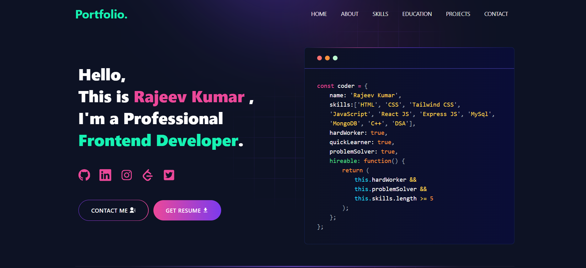

---
---

# 🌟 [Built Portfolio With GitHub](https://github.com/RajeevKrSah)

---

## 🌐 Portfolio Website

A **dynamic** and **modern portfolio website** built with **React**, **Vite**, and **Tailwind CSS** to showcase **projects**, **skills**, and **achievements** interactively. With **sleek animations** and **responsive design**, this portfolio offers a stunning **user experience**.

---

## 🚀 Demo



👉 **View Live Preview**: [Click here](https://rajeev-kumar-sah-portfolio.netlify.app/)

---

## 🤔 Struggling to Create a Professional Portfolio Website?

Look no further! You can use the **Developer Portfolio** template and create your very own personalized portfolio today! My website is designed to be **user-friendly** and **easily customizable**, making it perfect for **developers** and **freelancers**.

---

## 📑 Table of Contents

---

- [📂 Sections](#📂-sections)
- [✨ Features](#✨-features)
- [⚙️ Installation](#⚙️-installation)
- [🚀 Getting Started](#🚀-getting-started)
- [📦 Dependencies](#📦-dependencies)
- [💡 Usage](#💡-usage)
- [📜 Available Scripts](#📜-available-scripts)
- [🤝 Contributing](#🤝-contributing)
- [📄 License](#📄-license)

---

## 📂 Sections

- 🔝 **Hero Section**
- 👤 **About Me**
- 💼 **Experience**
- 🛠️ **Skills**
- 📁 **Projects**
- 🎓 **Education**
- ✍️ **Blog**
- 📬 **Contact**

---

## ✨ Features

- ⚛️ **React-based**: Fast, modular, and scalable components using **React 18**.
- 💫 **Beautiful Animations**: Bring life to your portfolio with **Lottie animations**.
- 🔀 **Smooth Routing**: Navigate easily with **react-router-dom**.
- 📧 **Email Integration**: Connect via **EmailJS** integration.
- 🔔 **Real-time Notifications**: Get notifications with **react-toastify**.
- 🎨 **Responsive Design**: Fully responsive and mobile-friendly using **Tailwind CSS**.
- 🚀 **Fast Development**: Optimized dev experience using **Vite**.

---

## ⚙️ Installation

Follow these steps to set up the project locally:

### Step 1: Install Git and Node

- [Download Git](https://git-scm.com/downloads)
- [Download Node](https://nodejs.org/en/download/)

### Step 2: Verify Installation

Ensure you have the latest versions installed:

```bash
node --version
git --version
```

---

## 🚀 Getting Started

### Fork and Clone the Repo

1. Fork the repo by clicking the **Fork** button on the top right.
2. Open your terminal and run the following commands:

```bash
git clone https://github.com/<YOUR_GITHUB_USERNAME>/portfolio-website.git
cd portfolio-website
```

### Install packages from the root directory

```bash
npm install
# or
yarn install
```

Then, run the development server:

```bash
npm run dev
# or
yarn dev
```

### Open [http://localhost:5174](http://localhost:5174) with your browser to see the result

---

## 📦 Dependencies

---

### This project is powered by the following technologies / Package

| Used Package List  |
| :----------------: |
|        react       |
|  react-router-dom  |
|  @emailjs/browser  |
|    lottie-react    |
| react-fast-marquee |
|    react-icons     |
|   react-toastify   |
|    tailwindcss     |

---

## 💡 Usage

To send emails from your portfolio, sign up at [EmailJS](https://www.emailjs.com/) and set up your account. The free plan allows 200 emails per month.

## 📜 Available Scripts

You can run the following scripts from the command line:

- `npm run dev`: Start the development server with hot reloading.
- `npm run build`: Create a production build of the project.
- `npm run preview`: Preview the production build locally.
- `npm run lint`: Check and enforce code quality using ESLint.

## 🤝 Contributing

Contributions are welcome! If you have ideas to improve this project, feel free to:

1. Fork the repo
2. Create your feature branch: `git checkout -b feature/AmazingFeature`
3. Commit your changes: `git commit -m 'Add some AmazingFeature'`
4. Push to the branch: `git push origin feature/AmazingFeature`
5. Open a pull request

## 📄 License

This project is licensed under the MIT License. See the [LICENSE](LICENSE) file for details.
